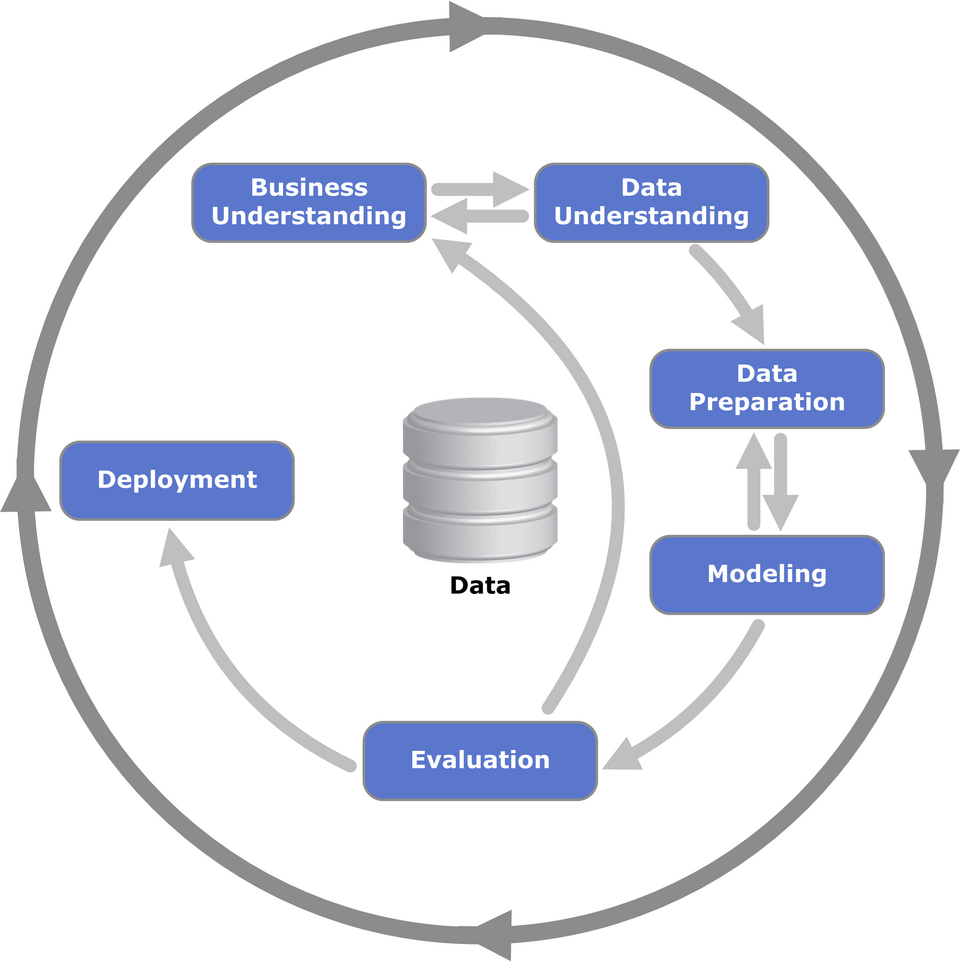
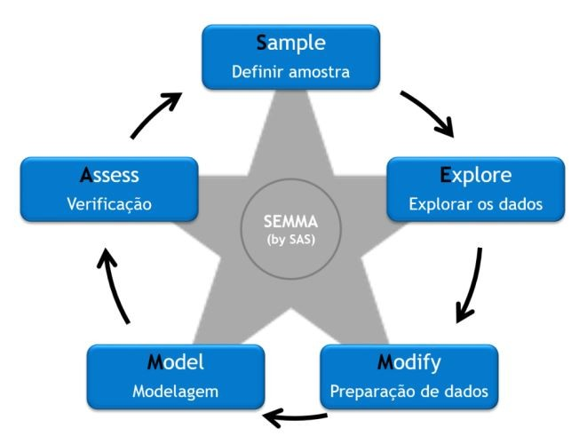
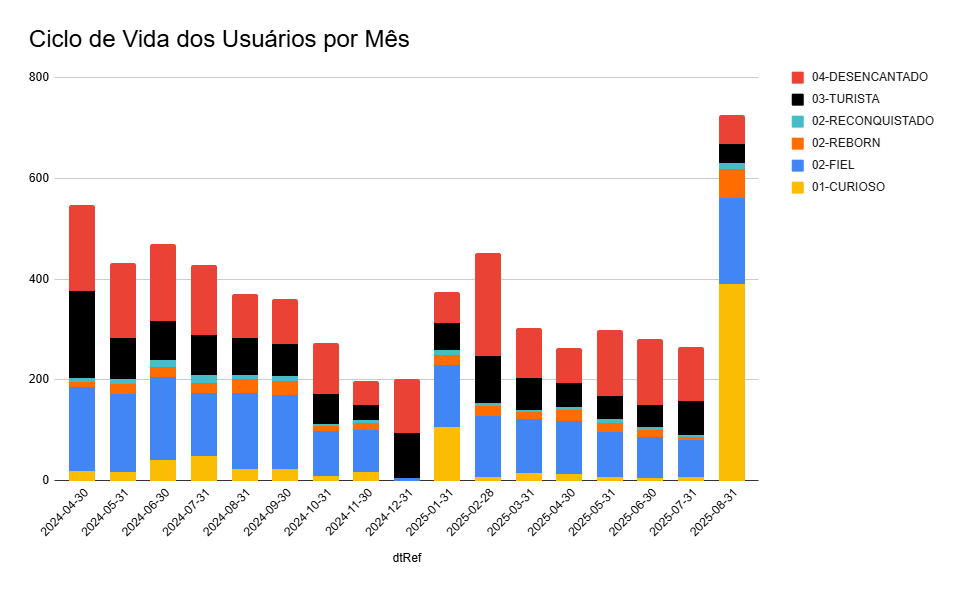

# Loyalty Predict

🔄 Projeto em desenvolvimento

Construindo uma solução de Data Science com o objetivo de identificar perda ou ganho de engajamento dos usuários da comunidade [Teo Me Why](https://teomewhy.org/).

# Índice

- [Ações](#ações)
- [Etapas](#etapas)
- [Principais Resultados](#principais-resultados)
- [Fonte de Dados](#fontes-de-dados)

## Ações

- Métricas gerais do TMW;
- Definição do Ciclo de Vida dos usuários;
- Análise de Agrupamento dos diferentes perfís de usuários;
- Criar modelo de Machine Learning que detecte a perda ou ganho de engajamento;
- Incentivo por meio de pontos para usuários mais engajados;

## Etapas

- Entendimento do negócio;
- Extração dos dados;
- Entendimento dos dados;
- Definição das variáveis;
- Criação das Feature Stores;
- Treinamento do modelo;
- Registro do modelo no MLFlow;
- Criação de App para Inferência em Tempo Real;
- Integração com Ecossistema TMW

As etapas seguiram as etapas metodologicas do CRISP-DM e do SEMMA para a criação do modelo.

## Principais resultados

- Definição e análise do ciclo de vida do cliente

## Fontes de Dados

- [Sistema de Pontos](https://www.kaggle.com/datasets/teocalvo/teomewhy-loyalty-system)
- [Plataforma de Cursos](https://www.kaggle.com/datasets/teocalvo/teomewhy-education-platform)

- [Link do repositório original](https://github.com/TeoMeWhy/loyalty-predict)